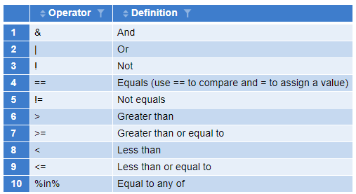

```{r}
#| include: False
library(tidyverse)
```

Please download this [Week 5 Download](downloadforstudent/week_5_studentversion.qmd) to get the .qmd for this weeks lesson. Practice importing this file into your project for this series!

## What is {tidyverse}?

The {tidyverse} is a *collection* of R packages that are designed to work together smoothly, so once you learn one, the others feel familiar. 

**Packages within this collection include:**

::: {.panel-accordion}

### dplyr
Houses lots of functions to help with data manipulation. Helps you filter, select, group data variables, and aggregate data. This is a great package for data wrangling.

Cool stuff you can do! 

*Note:* there are a lot of different preloaded datasets to play around with, like mtcars, iris, and (my personal favorite) penguins
```{r}
mtcars %>% 
  group_by(cyl) %>% 
  summarise(mean_mpg = mean(mpg))

```


### ggplot2
Create custom data visualizations, compatible with themes and other custom functions.

Cool stuff you can do! 
```{r}
ggplot(iris, aes(x = Species, y = Sepal.Length)) +
  geom_boxplot()
```
### tidyr
Data tidying and shaping. Helps you pivot, separate, join, and organize data structures.

Cool stuff you can do! 
```{r}
pivot <- pivot_longer(airquality, 
             cols = c(Ozone, Wind), 
             names_to = "variable", 
             values_to = "value")
head(pivot)
```
### readr
Reads in data files (like CSVs).

Cool stuff you can do! 
```{r}
# Example using a built-in readr dataset
read_csv(readr_example("mtcars.csv"))
```
### tibble
Creates a more modern version of a dataframe that is cleaner and easier to use.

Cool stuff you can do! 
```{r}
tibble(
  x = 1:5,
  y = x^2
)
```
### forcats
Works with **cat**egorical variables. Lets you build more customizable plots.

Cool stuff you can do! 
```{r}
fct_reorder(iris$Species, iris$Sepal.Length) %>%
  head()
```
### stringr
Makes it easy to detect, extract, replace, and clean up strings (text data).

Cool stuff you can do! 
```{r}
str_detect(c("apple", "banana", "pear"), "a")
```
### purrr
Lets you repeat operations without writing loops. Great for applying a function to many things at once.

Cool stuff you can do! 
```{r}
map_dbl(1:5, ~ .x^2)
```
### lubridate
Helps you parse, extract, and do math with dates and times.

Cool stuff you can do! 
```{r}
ymd("2024-02-01") + days(10)
```
:::


## Let's work with {tidyverse}!

Start off with loading in the package: 
```{r}
library(tidyverse)
```

And pick up where we left off last week working with basic dataframes. First, we will define the data.frame:

```{r}
# Define the data.frame
People <-    c("Ulrich","Dom","Sophia","Neha","ExampleRA")
Positions <- c("PI", "GE", "GE",   "GE",  "RA") 
Sleep <-     c(4,6,8,7,8) #Sleep in hours
Years <- c(25,6,2,2,1)#Years in our lab
Count <- c(1:length(People))#should indicate row number

df <- data.frame(People, Positions, Sleep, Years, Count)

head(df)
```

Now, let's do everything we just did with dataframes, but using tidyverse functions

We can use the package {dplyr} to group the data and aggregate by mean. Let's break it down first:


-   **`group_by()` function:** tells R how to organize your data before you do any calculations. We're essentially spliting our data into different groups to look closer at differences between groups.

```{r}
df %>% 
  group_by(Positions)
```

-   **`summarize()` function:** takes each group created by `group_by()` and computes something for it. (can be a mean, median, count, etc.). Where `group_by()` organizes the data but doesn't do any calculation, `summarize()` looks inside each group specified and computes a summary of whats inside.

```{r}
df %>% 
  group_by(Positions) %>% 
  summarise(mean_sleep = mean(Sleep, na.rm = T)) #note: summarize and summarise are the same function, dif spelling 
```

-   **piping, i.e., `%>%`:** The pipe connects steps together so you can read the code like a sentence. It makes your code flow top‑to‑bottom instead of nesting functions inside each other.

We use piping so that we can perform multiple functions on a single dataframe. where your dataframe is always the first argument in tidyverse functions- piping automatically fills that argument for you

Format:

```{r}
#dataframe %>% 
 # some_function() %>% 
 # the_next_function()
```

### How to extract or index variables

Let's using some new functions found in {tidyverse} packages to extract or index variables

```{r}
df$Positions # Get a column "Position"
df[,c("People","Positions")]
cbind(df$People,df$Positions) # Get multiple columns ("People" and "Position")
```

In the {tidyverse}, you can use `select()`

```{r}
df %>% 
  select(Positions) 

df %>% 
  select(People, Positions)
```

**Exercise 1.** Create a new dataframe called 'df_new' that contains only People, Positions, and Sleep (using `select()`)

```{r}

```

### Adding and removing variables (columns)

You can directly add variables

```{r}
df$RowNum <- 1:nrow(df)
```

or directly remove

```{r}
df$RowNum <- NULL
```

But in the {tidyverse}, you can use `mutate()` and `select()` (for adding and removing, respectively)

```{r}
df <- df %>% mutate(RowNum = 1:nrow(.), Years_2026 = Years + 1)

df <- df %>% select(-RowNum)

```

### Filtering rows by condition

Filtering is an operation to keep or remove certain rows

For example, we can filter rows corresponding to GEs

```{r}
df_only_GE <- df[Positions == "GE",]
```

In the {tidyverse}, you can use `filter()`

```{r}
df_only_GE <- df %>% 
  filter(Positions == "GE" | Sleep >= 6)
```
`filter()` is great for more complex filtering conditions, such as filtering out multiple conditions. Say you want to take out the first block of an experiment by subject becuase it was a practice block, and you also wanted to filter out people who were slower than average. You can do that easily with `filter()`!

{fig-align="center"}

This is the notation you want to use within the filter function, you can use multiple arguments in this function for complex jobs. 

### Why bother with the {tidyverse}?

So far, everything we learned we also learned a very similar way to do using base R functions. So why should we even use {tidyverse}?

{tidyverse} (particularly piping) is helpful for stacking functions:

```{r}
df %>% 
  select(-Count) %>% 
  mutate(sleep_ideal = Sleep + 2) %>% 
  filter(Positions == "RA")
```

It's also helpful for aggregating:

*What?* Aggregation means taking lots of individual data points and combining them into a smaller set of summary values. 

*Why?* We do this becuase raw data is often too detailed to interpret directly. It also helps us see patterns more clearly in the data, prepare data for more complicated statistical models (e.g. ANOVA, regression, t-tests), and helps us to communicate results clearly to a wide audience. 

*How?* For aggregation, we need to use `group_by()` and `summarize()`

Let's aggregate the average Sleep time for different Positions (PI,GE,RA)

```{r}
df %>%
  group_by(Positions) %>% 
  summarize(meanSleep = mean(Sleep, na.rm = TRUE))

# Sum of Sleep time for different Positions (PI,GTF,RA)

df %>% group_by(Positions) %>% 
  summarize(sumSleep = sum(Sleep, na.rm = TRUE))
```

What happens if you use People as a grouping variable?
```{r}

df %>% group_by(People) %>% 
  summarize(meanSleep = mean(Sleep, na.rm = TRUE)) # Since people is unique for every row, data will not be reduced at all!
```


What if we want to get mean Sleep time for (Group1 = PI & GE, Group2 = RA)

```{r}
#?ifelse()

df2 <- df%>% 
  mutate(PositionsR = ifelse(Positions == "RA", "RA", "PI&GE")) %>%
  group_by(PositionsR) %>% 
  summarize(meanSleep = mean(Sleep, na.rm = TRUE))
```

## Problem Set 5

Like last week, lets use the starwars dataset again. save this dataset as an object. 

**1.** Create a new dataframe called df_new that contains only: name, species, height. Use `select()`.
```{r}

```

**2.** Using the starwars dataframe:

Filter characters who are Human
```{r}

```

Filter characters who are Human OR Droid
```{r}

```

Filter characters who are Female AND taller than 170 cm
```{r}

```

**3.** Add a column called is_tall that is TRUE if height > 180
```{r}

```

**4.** In a different object, compute the mean height for each species
```{r}

```

Then compute the mean mass for each homeworld
```{r}

```

Lastly, compute the mean height and SD for each sex
```{r}

```

**5.** Two‑Step Aggregation. All in one pipe, compute mean height per species per homeworld  
THEN Compute the mean and SD of those homeworld‑level means per species. 

Use `group_by()` and `summarize()` in the first step, then pipe down into another `group_by()` and `summarize()` that acheives the second step. Check your work using `head()`. 
```{r}

```


