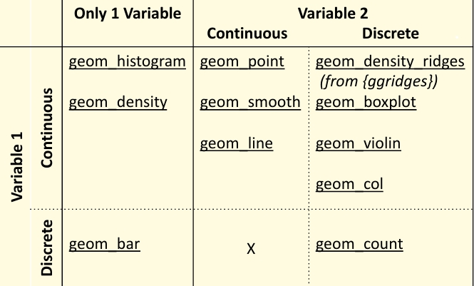

```{r}
#| include: False
library(tidyverse)
library(palmerpenguins)
```

Please download this [Week 6 Download](downloadforstudent/week_6_studentversion.qmd) to get the .qmd for this weeks lesson. Practice importing this file into your project for this series!

## {tidyverse} packages refresher

The {tidyverse} is a *collection* of R packages that are designed to work together smoothly, so once you learn one, the others feel familiar.

**Packages within this collection include:**

::: panel-accordion
### dplyr

Houses lots of functions to help with data manipulation. Helps you filter, select, group data variables, and aggregate data. This is a great package for data wrangling.

Cool stuff you can do!

*Note:* there are a lot of different preloaded datasets to play around with, like mtcars, iris, and (my personal favorite) penguins

```{r}
mtcars %>% 
  group_by(cyl) %>% 
  summarise(mean_mpg = mean(mpg))

```

### ggplot2

Create custom data visualizations, compatible with themes and other custom functions. (this is what we will be focusing on today!)

Cool stuff you can do!

```{r}
ggplot(iris, aes(x = Species, y = Sepal.Length)) +
  geom_boxplot()
```

### tidyr

Data tidying and shaping. Helps you pivot, separate, join, and organize data structures.

Cool stuff you can do!

```{r}
pivot <- pivot_longer(airquality, 
             cols = c(Ozone, Wind), 
             names_to = "variable", 
             values_to = "value")
head(pivot)
```

### readr

Reads in data files (like CSVs).

Cool stuff you can do!

```{r}
# Example using a built-in readr dataset
read_csv(readr_example("mtcars.csv"))
```

### tibble

Creates a more modern version of a dataframe that is cleaner and easier to use.

Cool stuff you can do!

```{r}
tibble(
  x = 1:5,
  y = x^2
)
```

### forcats

Works with **cat**egorical variables. Lets you build more customizable plots.

Cool stuff you can do!

```{r}
fct_reorder(iris$Species, iris$Sepal.Length) %>%
  head()
```

### stringr

Makes it easy to detect, extract, replace, and clean up strings (text data).

Cool stuff you can do!

```{r}
str_detect(c("apple", "banana", "pear"), "a")
```

### purrr

Lets you repeat operations without writing loops. Great for applying a function to many things at once.

Cool stuff you can do!

```{r}
map_dbl(1:5, ~ .x^2)
```

### lubridate

Helps you parse, extract, and do math with dates and times.

Cool stuff you can do!

```{r}
ymd("2024-02-01") + days(10)
```
:::

## Visualing using {ggplot2}

First, lets load {tidyverse} in our script. We will be using preloaded data from a package called {palmerpenguins} so install then load that into your script as well. The dataset is called **penguins**, lets inspect the data using `head()` and then check how many rows and columns it has using a function we've learned previously.

```{r}
#install and load packages first

head(penguins)
```

**Every `ggplot()` has 3 main components:**

**1. Data:** the data used to produce a plot. If you are using the pipe function `%>%` you can pipe your data into the plot before you use `ggplot()` and you dont have to specify data inside the plot.

Data can be called within `ggplot()`

```{r}
#| fig.show: "hide"
ggplot(penguins, aes(x = bill_length_mm, y = bill_depth_mm)) +
  geom_point()
```

or can be piped in

```{r}
#| fig.show: "hide"
penguins %>% 
ggplot(aes(x = bill_length_mm, y = bill_depth_mm)) +
  geom_point()

```

**2. Aesthetic mappings:** this is achieved using the `aes()` function within `ggplot()`. it specifies how variables in the data are mapped to visual properties.

**Some visual properties include:**

-   x
-   y
-   color
-   fill
-   alpha
-   others (linetype, shape, linewidth, size, group)

```{r}
ggplot(penguins, aes(x = bill_length_mm, y = bill_depth_mm, color = species)) +
  geom_point()
```

***Exercise 1.*** play around with the `aes()` function in the ggplot above, use some other aes mapping like alpha = to see what it does.

3.  **Layer(s):** this is usually achieved using `geom_*()` and adding additional layers on top. You will use a `geom_*()` function to represent data points. some `geom_*()` functions include:



*note.* within ggplot, you need to use `+` instead of `%>%` to add layers, its just the syntax.

```{r}
ggplot(penguins, aes(x = flipper_length_mm, fill = species)) + #for a histogram, need to specify fill in aes() and no Y-axis
  geom_histogram(binwidth = 5, color = "white")

```

You can also use the `aes()` function in different layers within `ggplot()`.

```{r}
ggplot(penguins, aes(x = bill_length_mm, y = bill_depth_mm)) +
  geom_point(aes(color = species))
```

***Exercise 2.*** I want to add a layer to the ggplot above that adds a line by species. Add a geom layer called `geom_smooth()` and using `aes()` inside the `geom_smooth()` use linetype = to specify you want the lines to use linetype by species.

```{r}
ggplot(penguins, aes(x = bill_length_mm, y = bill_depth_mm)) +
  geom_point(aes(color = species))+ 
  geom_smooth(aes(color = species, linetype = species), method = lm, se = F)
```

## Visualizing aggregated data

Using our Penguins dataset, lets aggregate the data so we can visualize some cool stats! I want to aggregate by species and get the mean body mass per species of pengies.

```{r}
penguins_bodymass_agg <- penguins %>%
  group_by(species) %>%
  summarize(
    mean_body_mass = mean(body_mass_g, na.rm = T) #whats missing here??
  )

head(penguins_bodymass_agg)
```

Now lets create a bar plot of body mass per species.

```{r}
ggplot(penguins_bodymass_agg,
       aes(x = species, y = mean_body_mass, fill = mean_body_mass)) +
  geom_col()
```

This is great, but lets add some more visual context using `labs()` function. `labs()` is used in ggplot, and lets you add a title, axis labels, captions, and labels!

```{r}
ggplot(penguins_bodymass_agg,
       aes(x = species, y = mean_body_mass, fill = factor(mean_body_mass))) +
  geom_col() +
  labs(
    title = "Mean Body Mass by Species",
    x = "Species",
    y = "Mean Body Mass (g)", 
    fill = "Avg Body Mass by Species"
  )

```

You can also change the theme of the figure to look more presentable using `theme_*()`. There are also packages that are made just for fun visual themes, one is called {ggthemes}

***Exercise 3.*** Look up online a list of different themes in {ggthemes} you can add in ggplot(). Install then load in this package and pick a theme you like and use it!

```{r}
ggplot(penguins_bodymass_agg,
       aes(x = species, y = mean_body_mass, fill = mean_body_mass)) +
  geom_col() +
  labs(
    title = "Mean Body Mass by Species",
    x = "Species",
    y = "Mean Body Mass (g)", 
    fill = "Avg Body Mass by Species"
  ) +
  theme_minimal() #replace with a theme of your choosing! 
```

***Exercise 4.*** I want to aggregate by species and island. To a new object, use the penguins data and `group_by()` species and island, then `summarize()` the mean body mass of penguins AND the mean flipper length of penguins. name these mean_mass and mean_flipper in the summarize function.

```{r}
#| include: False
penguins_s_i <- penguins %>%
  group_by(species, island) %>%
  summarize(
    mean_mass = mean(body_mass_g, na.rm = TRUE),
    mean_flipper = mean(flipper_length_mm, na.rm = TRUE)
  )

```

```{r}

```

Now I want to see this new aggregated data in two side-by-side plots separated by the island variable. We can do this by faceting using the function `facet_wrap()`:

```{r}
ggplot(penguins_s_i,
       aes(x = species, y = mean_mass, fill = island)) +
  geom_col(position = "dodge") +
  facet_wrap(~ island) +
  labs(
    title = "Mean Body Mass by Species and Island",
    x = "Species",
    y = "Mean Body Mass (g)"
  )

```

There are many more cool things you can add to a ggplot plot, the internet is your friend for all the customizable ways you can use this function!

## Problem Set 6

**1.** Create a scatterplot of flipper_length_mm (x‑axis) vs body_mass_g (y‑axis) using the penguins dataset. Color the points by species and add a title using `labs()`

```{r}

```

**2.** Using bill length and bill depth:

-   Create a scatterplot

-   Add a `geom_smooth()` layer

-   Use linetype = species inside the `geom_smooth()` layer

-   Turn off the confidence interval `(se = FALSE)`

```{r}

```

**3.** Make a histogram of flipper_length_mm:

-   Use fill = species

-   Set binwidth = 5

-   Add a white border around bars (color = "white")

```{r}

```
