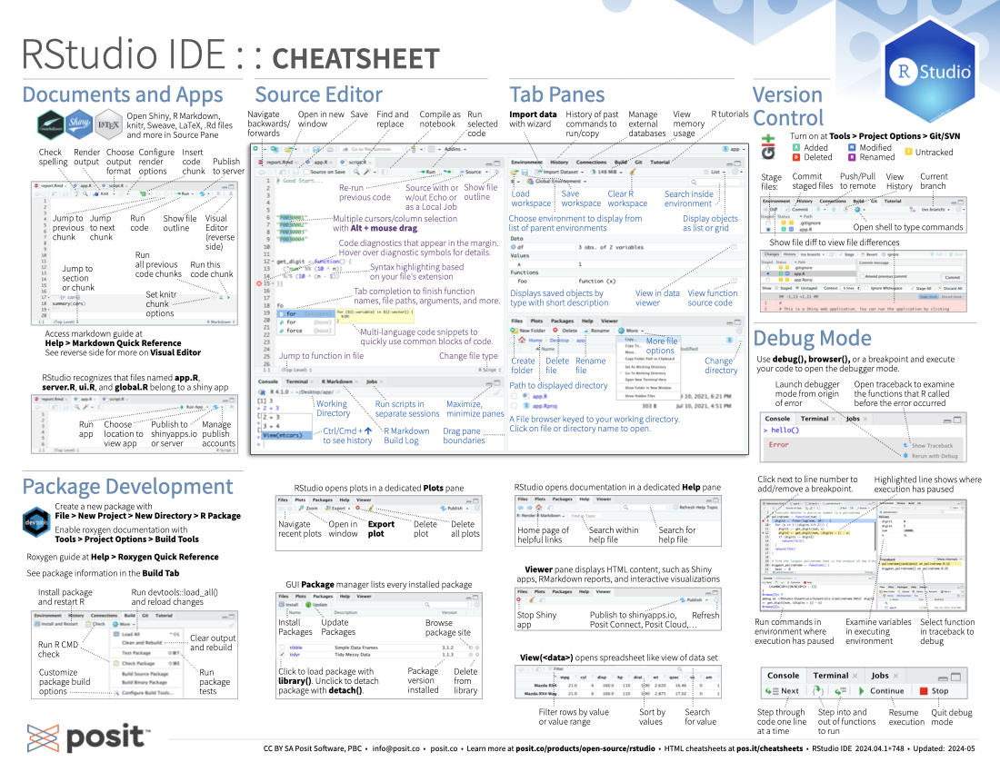
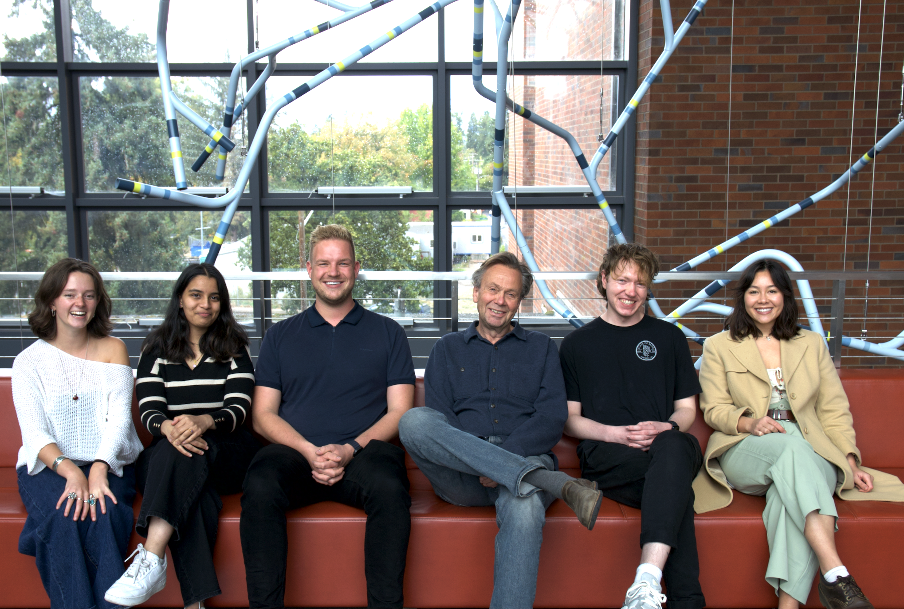

Hi Cognitive Dynamics Folks! If you're new to R, you can get started by installing the latest version of R from the official [CRAN download page](https://cran.r-project.org/) and then downloading RStudio from the official [RStudio (Posit) download page](https://posit.co/download/rstudio-desktop/). Together, these tools provide everything you need to write code, build visualizations, and explore data.

*Note:* Make sure you follow the download instructions that are suited for your computer (Mac, Windows, Etc.)!

::: {.panel-tabset}
## Important Notes Before You Start {.panel-name}

**Note 1.** We will mention this again but when you are naming a folder, project, script or file ***PLEASE*** **do not use space.** R has a hard time reading this when you want to import data or change working directories, and in general it is best practice not to have spaces. UseCamelCase or use_snake_case_instead! 

**Note 2.** Get orientated to what RStudio looks like, understanding all the different things the interface contains will help so much with troubleshooting.

## R Glossary {.panel-name}

For your reference I've compiled a shortlist of R & Computer Science jargon that will inevitably be used when we are explaining basics of R!

- **Root Directory** — The top‑level folder of your project or file system. Everything else lives inside it. In RStudio projects, the root directory is the project folder.

- **Working Directory** — The folder R is currently “looking at” for reading and writing files.
Check it with `getwd()` and change it with `setwd()` (though RStudio Projects handle this automatically).

-   **Object** — A piece of data stored in R (a number, vector, dataset, model, plot, etc.).

-   **Variable** — A name that refers to an object (e.g., `x <- 5`).

-   **Assignment (**`<-`**)** — The operation of storing a value in a variable.

-   **Function** — A reusable piece of code that performs a task; always written with parentheses (e.g., `mean()`).

-   **Argument** — Information you pass into a function so it knows what to do (e.g., `by = 2` in `seq()`).

-   **Console** — The place where R runs your code and prints output, errors, and messages.

-   **Script** — A saved file containing R code (`.R` or `.qmd`) that you run from the editor.

-   **Environment** — A list of all objects currently stored in your R session.

-   **Vector** — A one‑dimensional list of values of the same type (e.g., `1:10`, `c("a", "b")`).

-   **Data Type (Class)** — The kind of data an object holds (numeric, character, integer, logical, factor, complex).

-   **Knitting / Rendering** — The process of turning a `.qmd` or `.Rmd` file into a finished HTML, PDF, or Word document.

-   **Code Chunk** — A block of R code inside a Quarto document that runs and displays output.

-   **Comment (**`#`**)** — Text that R ignores; used to explain code or leave notes.

-   **Error** — A message indicating R could not run your code; execution stops.

-   **Warning** — A message indicating something might be wrong, but R still ran the code.

-   **Logical Value** — TRUE or FALSE; used in comparisons and filtering.

-   **Indexing** — Selecting specific elements from a vector or dataset (e.g., `x[3]`).

-   **Session** — Your current R workspace, including objects, loaded packages, and Console history.

- **snake_case** — A naming style where words are separated by underscores (e.g., my_variable_name).
This is the preferred style in tidyverse code.

- **camelCase** — A naming style where words are joined and each new word starts with a capital letter (e.g., myVariableName). Common in JavaScript and some R packages, but less common in tidyverse workflows.

-   **Package** — A collection of functions, data, and documentation that extends R’s capabilities. 

## Tidyverse Glossary {.panel-name}

{tidyverse} is a very popular package we will get acquainted with closely as we learn about data cleaning and wrangling. Here are some important terms for your reference: 

- **{tidyverse}** — A collection of R packages designed for data science, all sharing a consistent grammar and philosophy.

- **Pipe (`%>%`)** — A tool for writing readable code by passing the output of one function into the next.

- **Tibble** — A modern, tidyverse‑friendly version of a data frame that prints cleanly and behaves more predictably.

- **Aesthetic (aes)** — In {ggplot2}, the mapping between data and visual properties (e.g., `aes(x = mpg, y = hp, color = cyl)`).

- **Geoms** — Geometric objects in {ggplot2} that define what kind of plot you’re making (e.g., `geom_point()`, `geom_bar()`, `geom_line()`).

- **Faceting** — Splitting a plot into multiple panels based on a variable (`facet_wrap()`, `facet_grid()`).

- **Tidy Data** — A data format where: each variable is a column, each observation is a row, each value is a cell. This structure makes data easier to manipulate and visualize.
:::

## About This Series

This website is a compilation of all the scripts revised over the years created and taught by the various graduate students in the Cognitive Dynamics Lab. I (one of the current grad students Sophia) made this website as a place for all these files to live in a more straightforward way, and added some clarifying elements to each weeks content. I hope this resource will be a good tool to reference back to for y'all as young researchers and will help streamline teaching this series for future grad students. 

Thank you to everyone who contributed to each weeks content over the years and imparted their knowledge to the next round of R users. Yay collective knowledge!!

